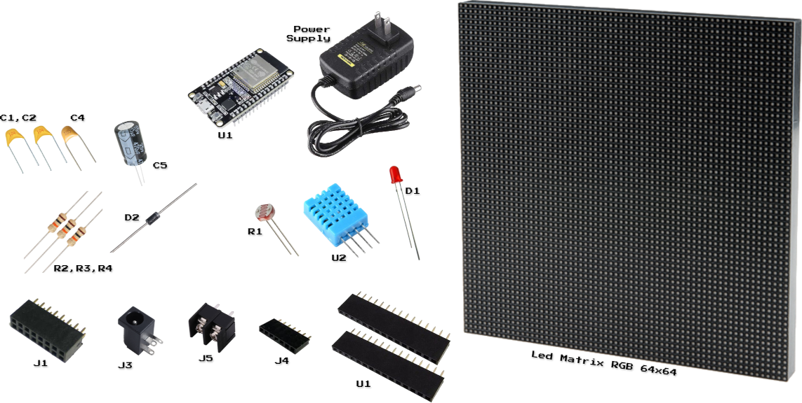

# **WiseShield-32 Soldering Guide**

## **Introduction**

Welcome to the WiseShield-32 soldering guide! This manual will walk you through the step-by-step process of assembling your WiseShield-32 PCB. Follow along carefully, and you’ll have your board ready for use in no time!

## **Before You Start**

### **Tools Required**:

* Soldering iron and solder wire
* Wire cutters
* Tweezers
* Desoldering pump (optional but helpful)
* Multimeter (for testing connections)

### **Tips for Success**:

1. Always work in a well-ventilated area.
2. Use proper ESD precautions to protect sensitive components.
3. Double-check component orientation, especially for polarized parts like diodes and capacitors.
4. Start with the smallest components and work your way up to larger ones.

## **Step-by-Step Instructions**

### **Step 1: Gather and Identify Components**

Use the provided labeled PCB image to locate the positions of each component on the board. Match each part with the silkscreen markings (e.g., C1, R2, J1).

**Reference Labeled PCB Image**:

**Base:**
* RGB LED Matrix 64x64 + Cables
* ESP32 Dev Board
* AC/DC Power Supply 5V 3A
* WiseShield-32 PCB

**Connectors:**
* J1 HUB75 Connector
* J3 Barrel Jack Power Supply Connector
* J5 Terminal Block (Display Power)
* J4 7-pin Female Header - Shield Extension
* U1 ESP32 Female Headers (2x15)

**Discrete Components:**
* C1, C2 Ceramic/Tantalum Capacitor 100nF
* C3 Capacitor 100uF (not included, optional to help stabilize ESP32 voltage input)
* C4 Ceramic/Tantalum Capacitor 1uF
* C5 Electrolytic Capacitor 470uF
* D2 Diode 1N5819
* R2, R3, R4 Resistor 10K

**I/O:**
* U2 DHT11 Sensor
* R1 LDR 5mm A9050
* D1 LED 3mm

### **Step 2: Solder the Smallest Components First**

1. **Resistors (R2, R3):**
   * **Function**: R2 is a pull-down resistor for the LDR, and R3 limits current for the LED.
   * **Placement**: Refer to the labeled PCB image for exact locations.
   * **Instructions**:
     1. Insert the resistor leads into the holes.
     2. Flip the board and bend the leads slightly to hold them in place.
     3. Solder the leads and trim excess wire.

2. **Small Capacitors (C1, C2, C4):**
   * **Function**: Stabilizes voltage for the ESP32.
   * **Placement**: Near the ESP32 pins and power traces.
   * **Instructions**:
     1. Insert capacitors, ensuring correct orientation if polarized (e.g., C4).
     2. Solder and trim the excess leads.

### **Step 3: Solder Larger Capacitors and Diode**

1. **Large Capacitors (C5):**
   * **Function**: Regulate voltage for stability.
   * **Placement**: Near the power input section.
   * **Instructions**:
     1. Insert capacitors into their positions.
     2. Align the longer lead (positive) with the "+" marking.
     3. Solder and trim.

2. **Diode (D2):**
   * **Function**: Blocks reverse current.
   * **Placement**: Near the power input (J3).
   * **Instructions**:
     1. Align the cathode stripe with the silkscreen marking.
     2. Solder both leads and trim excess.

### **Step 4: Add the Connectors**

1. **J3 (Power Input - Barrel Jack):**
   * Insert and solder the barrel jack connector securely.
2. **J6 (Power Input - Terminal Block):**
   * **Note**: Do not use J3 and J6 simultaneously.
   * Insert and solder the terminal block.
3. **J1 (HUB75 Connector):**
   * Solder all pins of the 2x8 pin header for the LED matrix connection.
4. **J5 (Display Power - Terminal Block):**
   * Insert and solder securely.
5. **J4 (Expansion Header - 1x7 Pin):**
   * Solder the header pins for custom peripherals.

### **Step 5: Add Peripherals**

1. **LDR (R1):**
   * Insert the light-dependent resistor and solder it along with R2.
2. **Indicator LED (D1):**
   * Insert the LED, ensuring the longer leg (anode) aligns with the "+" marking.
   * Solder and trim the leads.
3. **DHT11 Sensor (U2):**
   * Insert the temperature and humidity sensor and solder carefully.

### **Step 6: Prepare the ESP32 DevKit**

1. Solder the **female headers** into the ESP32 footprint (U1).
2. Plug the ESP32 DevKit into the headers once soldered.

### **Step 7: Final Inspection**

1. Inspect all solder joints for:
   * Good connections (shiny, smooth).
   * No solder bridges between adjacent pads.
2. Test connections with a multimeter to verify continuity.
3. Clean the PCB with isopropyl alcohol to remove flux residue.

## **Congratulations!**

Your WiseShield-32 is now fully assembled. You’re ready to proceed to the setup stage and start using your Clockwise.